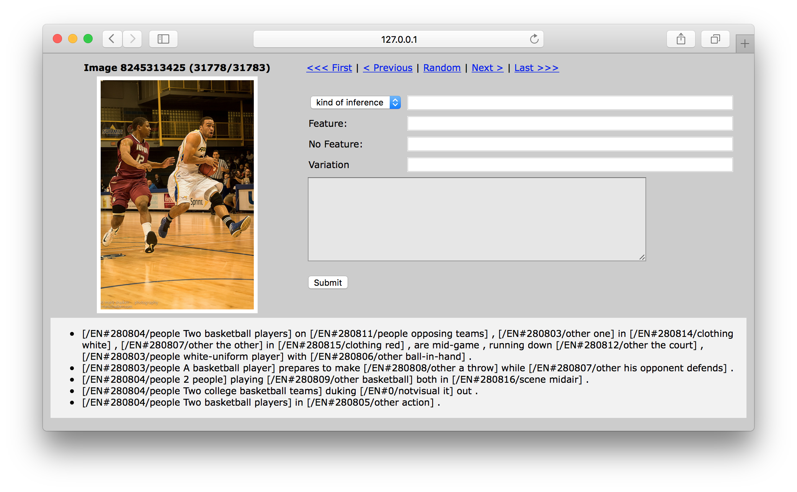
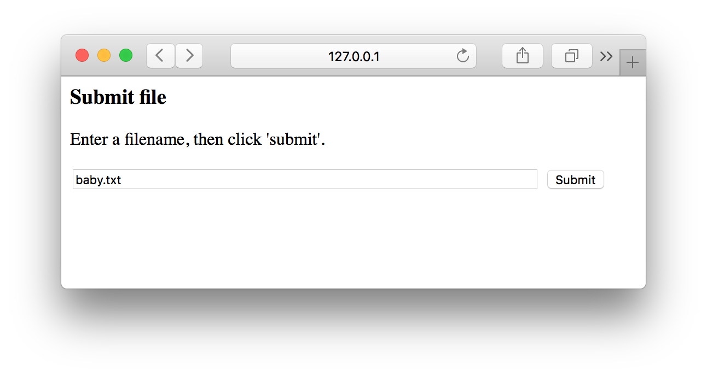
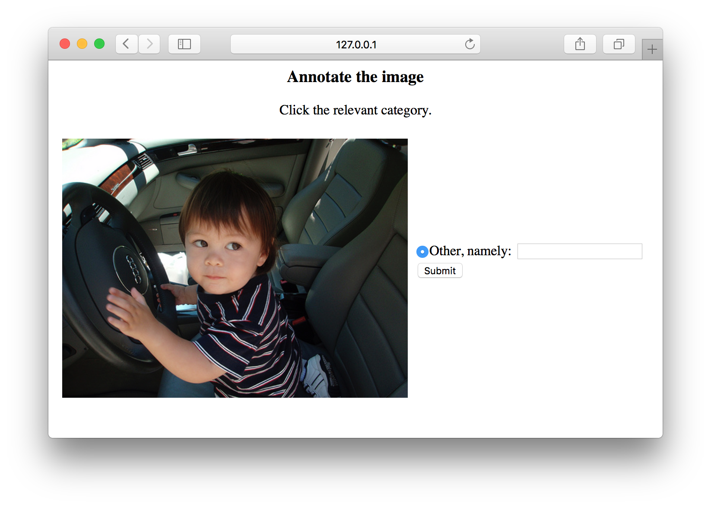

# Image Annotation Tools
*For the Flickr30k dataset*

This repository contains all the code you need to look through the
Flickr30k images and write notes about them, right in your browser.
There are two separate tools: one general tool that I made for the annotation of unwarranted inferences (but that you can also just use to page through the data), and one tool that I made to quickly add tags to a subset of the images. Both tools were made using Flask.

**Requirements**

* Flask
* Python 3 (the code may also work on Python 2, but I only tested it on 3)
* The Flickr30kEntities dataset (images + descriptions)

**Set-up**

* Clone this repository
* Copy the Flickr30k data to the relevant folders in `./static/`
* Install Flask

## General tool
The general tool is very versatile. It features navigation (so you can go to the first, previous, random, next, and last image), and several text boxes for annotation.

The top four input fields are easily modifiable through Javascript (see `templates/image_page.html`). I made them so that my annotations got written to the larger text area in a standardized (machine-readable) format. The text area contains everything that will be saved to an external file called `comments.txt`.

Start this tool by running `python image_viewer.py` on the command line. Python will then serve the image viewer at `http://127.0.0.1:5000/`.

## Subset tagger
This tool is useful if you want to quickly tag a portion of the data, for example a sample of the files that contain the word 'baby'. Here is how to use this tool:

1. Write all the relevant file IDs to a `.txt` file in the `noun_files` directory. E.g. `baby.txt`.

2. Start this tool by running `python annotate_selection.py` on the command line. Python will then serve the image viewer at `http://127.0.0.1:5000/`.

3. Enter the file name in the 'Submit file' window:

4. Start tagging. The tool will automatically add new tags that you enter in the 'other' text box.

